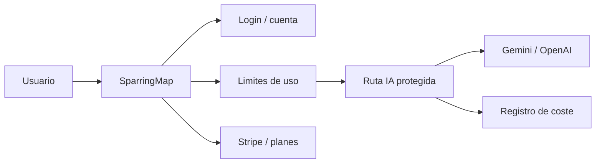

# SparringMap - estrategia de producto y fases futuras

Este documento guarda decisiones y contexto para que el trabajo no dependa de
una conversacion concreta con un agente.

## Situacion actual

SparringMap esta pensada, por ahora, como herramienta privada de Noelia/Lia para
probar si el flujo aporta claridad estrategica real en el dia a dia.

Estado actualizado a 5 de julio de 2026: la app ya permite trabajar con mapas
estrategicos guardados localmente, versiones, estados por nodo y exportaciones
para sacar el resultado fuera de la interfaz.

La app usa claves de IA configuradas localmente en servidor mediante:

- `GEMINI_API_KEY`
- `OPENAI_API_KEY`

Mientras sea privada, el consumo de IA cae sobre la cuenta/API key configurada
por Noelia/Lia.

## Objetivo de la fase privada

Usar la app durante varias semanas con ideas reales para validar:

- si ayuda a pensar mejor;
- si reduce dispersion;
- si los mapas son accionables;
- si las preguntas criticas aportan valor;
- si los documentos exportados sirven para trabajar fuera de la app;
- que partes del flujo sobran, confunden o faltan.

No se recomienda construir monetizacion antes de esta validacion.

## Camino posible 1: herramienta personal potente

Mantener SparringMap como herramienta privada avanzada.

Implicaciones:

- sin login;
- sin pagos;
- sin multiusuario;
- persistencia local o backup manual;
- foco en velocidad, exportaciones y calidad del sparring;
- costes de IA asumidos por Noelia/Lia.

Este camino es el mas simple y puede ser suficiente si el valor principal es uso
personal.

Estado actual de exportaciones para uso privado:

- documento editable para Word o Google Docs;
- Markdown para Notion o documentacion;
- informe imprimible/PDF;
- mapa visual imprimible/PDF con tarjetas SVG legibles, estado de nodo y sin
  controles de interfaz;
- backup JSON como formato recuperable para mover o restaurar proyectos.

## Camino posible 2: beta cerrada

Permitir que 3-10 personas prueben la app de forma controlada.

Requisitos antes de abrir beta:

- autenticacion basica;
- base de datos para usuarios/proyectos;
- limites de uso por usuario;
- proteccion de rutas IA;
- registro aproximado de coste por generacion;
- politica basica de privacidad;
- sistema para desactivar o limitar usuarios si el coste sube.

Las claves de IA seguirian siendo de la cuenta del proyecto, no de cada usuario,
pero con limites internos para evitar abuso.

## Camino posible 3: producto vendible a pequena escala

Convertir SparringMap en un SaaS pequeno o herramienta de pago.

Requisitos:

- login;
- billing, por ejemplo Stripe;
- planes o trial limitado;
- limites por plan;
- control de coste por usuario;
- dashboard interno de consumo;
- gestion de cuotas y errores de proveedores;
- privacidad y tratamiento de ideas sensibles;
- decision sobre almacenamiento: local, Supabase u otra base de datos;
- terminos claros de uso.

La arquitectura recomendada seria:

## Decision pendiente

Todavia no esta decidido si el producto sera:

- herramienta privada;
- beta cerrada;
- SaaS vendible a pequena escala.

No implementar login, pagos, Supabase, trials o despliegue publico hasta tomar
esa decision conscientemente.

## Proximas fases recomendadas

### Fase A - Uso privado y friccion real

- Probar el flujo completo con casos reales.
- Registrar fricciones de uso diario.
- Seguir puliendo exportaciones, panel derecho y onboarding segun uso real.
- Mantener el sistema local y simple.

### Fase B - Estabilizacion tecnica

- Dividir `AppShell`.
- Dividir `InspectorPanel`.
- Separar estado de proyecto, mapa, IA, refinamiento y exportacion.
- Ampliar tests de schemas, layout, almacenamiento y exportaciones.
- Anadir pruebas de navegador para exportaciones visuales e impresion.
- Revisar accesibilidad y rendimiento.

### Fase C - Preparacion beta

Solo si se decide abrir a otras personas:

- definir entorno de despliegue;
- proteger rutas IA;
- anadir auth;
- anadir limites de uso;
- registrar coste por usuario;
- decidir persistencia remota;
- escribir politica de privacidad.

### Fase D - Trial / monetizacion

Solo si se decide vender:

- planes;
- trial;
- pagos;
- cuotas;
- dashboard de costes;
- soporte minimo;
- terminos de uso.

## Regla de producto

Cada nueva funcion debe responder a una de estas preguntas:

- ayuda a decidir mejor;
- reduce friccion del flujo real;
- mejora claridad del entregable;
- protege datos, costes o mantenimiento.

Si no cumple ninguna, aparcarla.
